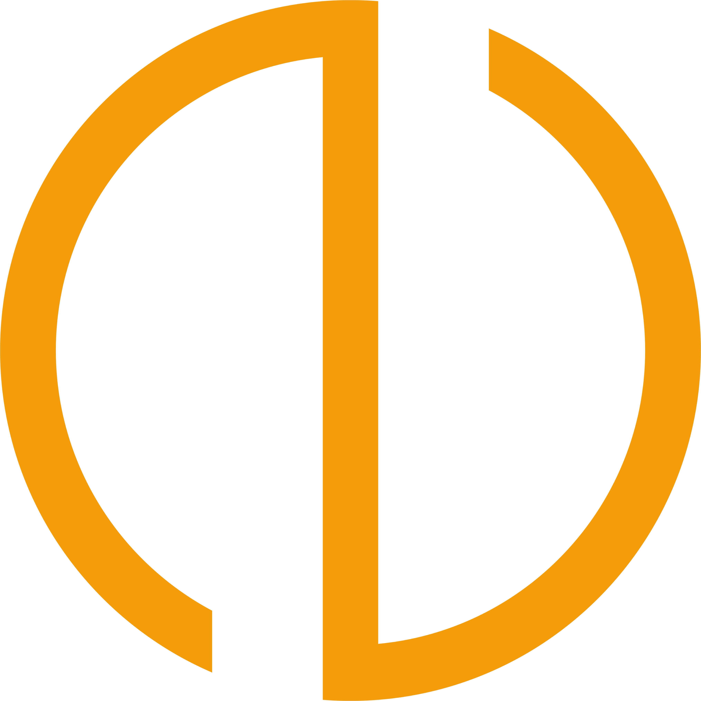

# NOVA Academy — نُوا آکادمی

**یادگیری انگلیسی با نُوا آکادمی**

> «آموزش جذاب، کاربردی»

کلاس زبان انگلیسی برای تمام سنین (۷ تا ۷۰ سال) — آنلاین در سراسر کشور، حضوری در تبریز و سلماس

---

## 🌐 پیش‌نمایش زنده

[**مشاهدهٔ کامل وب‌سایت در مرورگر**](https://kian-malekzadeh.github.io/NOVA-Academy/)

سایت به‌صورت دائمی روی **GitHub Pages** منتشر شده است — با کلیک روی لینک بالا، خروجی کامل صفحه (فارسی RTL) مستقیم در مرورگر نمایش داده می‌شود.

---

## دربارهٔ پروژه

**نُوا آکادمی (NOVA Academy)** یک وب‌سایت تک‌صفحه‌ای و کاملاً فارسی (RTL) برای آموزشگاه زبان انگلیسی است. این صفحه با هدف معرفی حرفه‌ای و شادِ دوره‌ها، روش برگزاری کلاس‌ها و راه‌های ارتباط با آموزشگاه طراحی شده است؛ از کودکان تا بزرگ‌سالان (۷ تا ۷۰ سال)، آنلاین در سراسر کشور و حضوری در **تبریز و سلماس**.

محتوای صفحه مستقیماً از سند محتوایی برند استخراج شده و هیچ آمار، نظر یا اطلاعات ساختگی در آن درج نشده است.

**گزینهٔ ۳ — انتشار با GitHub Pages:**
سایت از طریق **GitHub Pages** منتشر شده است و به‌صورت دائمی در آدرس زیر در دسترس است:
`https://kian-malekzadeh.github.io/NOVA-Academy/`

> فونت‌های «وزیرمتن» (Vazirmatn) و «بالو ۲» (Baloo 2) از Google Fonts بارگذاری می‌شوند؛ برای نمایش کامل، اتصال اینترنت لازم است.

## 🎨 سیستم طراحی

| مؤلفه | مشخصات |
| --- | --- |
| سبک | Claymorphism — سطوح نرم سه‌بعدی، حاشیهٔ ۳px، سایهٔ دوتایی |
| آبی اصلی | `#2563EB` |
| زرد | `#F59E0B` |
| صورتی | `#EC4899` |
| بله | `#00B894` |
| تلگرام | `#26A5E4` |
| فونت فارسی | Vazirmatn |
| فونت لاتین | Baloo 2 |
| آیکون‌ها | SVG خالص (لوساید + گلیف‌های برند تلگرام/بله) |

## ♿ دسترس‌پذیری

- کنتراست رنگ حداقل ۴.۵:۱
- حلقهٔ فوکوس واضح برای ناوبری کیبورد
- برچسب‌های `aria-label` برای دکمه‌های آیکونی
- لینک «پرش به محتوای اصلی»
- پشتیبانی از `prefers-reduced-motion`
- نشانه‌گذاری معنایی (header, main, section, footer)

## ⚖️ مجوز

© ۱۴۰۵ **Kian Malekzadeh — Kia Academy** — تمامی حقوق محفوظ است.
